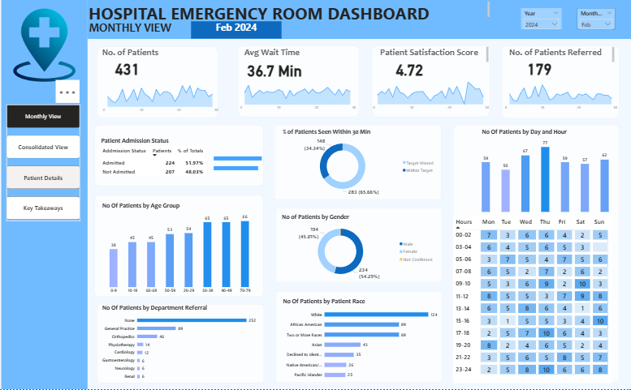
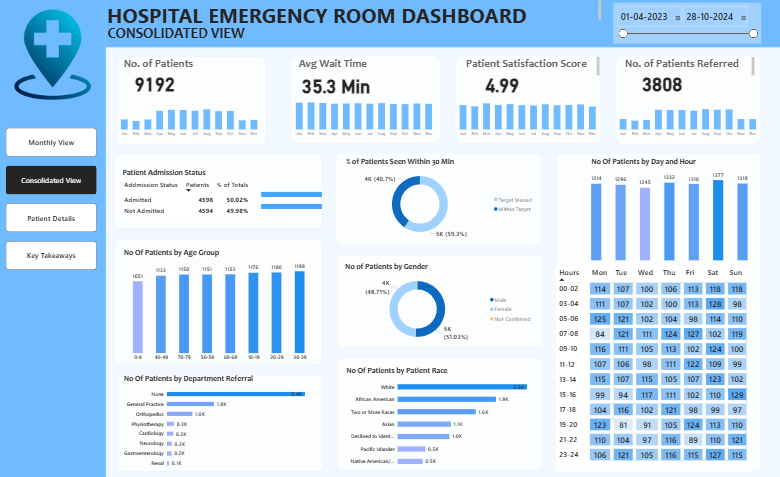

# 🏥 Hospital Emergency Room Dashboard | Power BI

## 📊 Project Overview

This Power BI dashboard provides a comprehensive analysis of hospital emergency room operations, patient flow, wait times, referrals, and satisfaction scores.

The dashboard helps healthcare management monitor performance and improve decision-making.

---

## 🛠 Tools & Technologies Used

- Microsoft Power BI
- Data Cleaning
- Data Modeling
- DAX
- Data Visualization

---

## 📈 Key Insights

- Total Patients: 9,192
- Average Wait Time: 35.3 minutes
- Satisfaction Score: 4.99 / 10
- Admission Rate: ~50%

Major Referrals:

- General Practice
- Orthopedics
- Physiotherapy

Peak Busy Days:

- Monday
- Saturday
- Tuesday

Peak Busy Hours:

- 11 AM
- 7 PM
- 11 PM

---

## 📷 Dashboard Preview

### Monthly View

---

### Consolidated View

---

### Patient Details

---

### Key Takeaways

---

## 📂 Project File

You can download the Power BI file from this repository:

HOSPITAL EMERGENCY ROOM DASHBOARD.pbix

---

## 🎯 Skills Demonstrated

- Dashboard Design
- Healthcare Data Analysis
- Business Intelligence
- KPI Monitoring
- Data Storytelling

---

## 👩‍💻 Author

Nida Dabir

Data Science Student | Power BI | Tableau | Python

